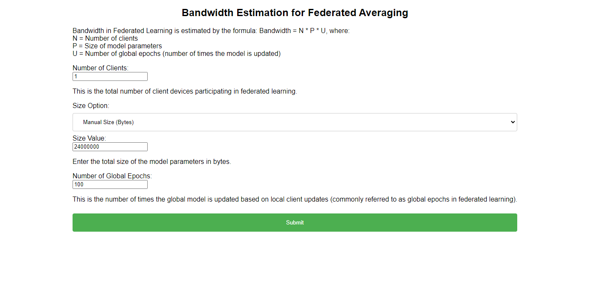
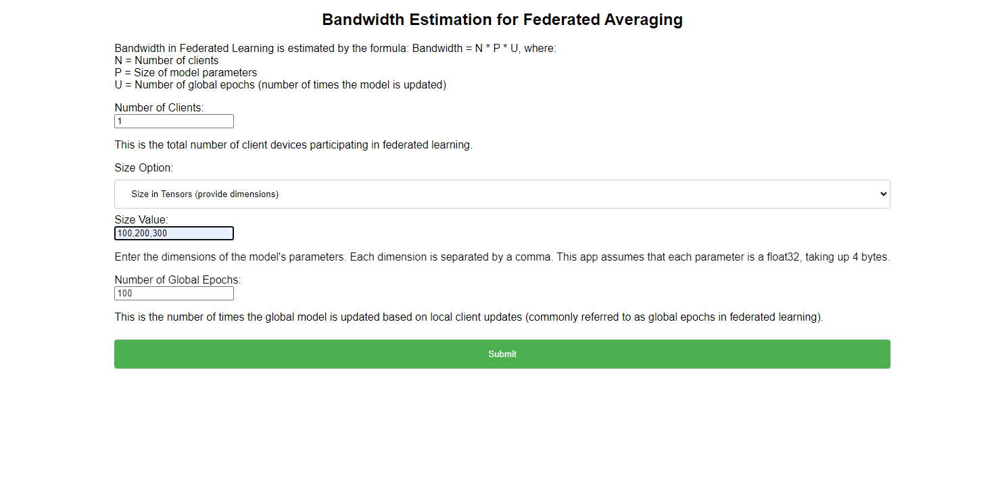

# CPS 595 - Software Engineering Project

# Project Title:  BWEFL-WebApp

### Team Members
 - Rahul Theresaraj

### Mentors
 - Dr. Phu Phung
 - Dr. Ahmed El Ouadrhiri

 ### Company Sponsor and Mentors
 - UDRI
   - 

## Project Management Information

Source code repository (private access): 
```sh
https://github.com/RahulTheresaraj/BWEFL-WebApp
```

### Revision History
| Date       |   Version     |  Description |
|------------|:-------------:|-------------:|
| DD/MM/YYYY |  0.0          | Init draft   |


## Overview
- In recent years, there is an emerging technology in the tech field known as Tiny Federated Learning, TFL for short. The TFL is derived from insertion of two machine learning fields which are TinyML and Federated Learning. TinyML  is deployment of machine learning models on resource-constrained devices, such as microcontrollers and low-powered embedded systems.  These have limited computational capabilities i.e, low processing power, memory and energy resources which makes it difficult to run models with large dataset and Federated learning is a machine learning approach that allows multiple devices or servers to train a model while preserving data on the local devices. The TFL  approach enables federated learning on small embedded devices with low computational resources. 


## Project Context and Scope
- Tiny Federated learning also known as TFL is an approach that deals with the intersection of two fields, each field has its challenges and together few of the challenges can be adapted. But it's still has few challenges that are yet to be resolved and those challenges in TFL are determining the Bandwidth communication or Bandwidth range and effective communication, As the federated learning model requires lot of computational resources as it deals with larger dataset and models, To use that in a embedded device is like going overboard and to send data or update to the server from an embedded device might result in loss of data while transmission, so it necessary to predict an estimated bandwidth to optimize communication efficiency.
- The Main motivation of this project is to determine the estimated bandwidth communication in Tiny federated learning and depending on the estimated bandwidth, the communication cost can be reduced to further evolve the bandwidth range.

## Federated Learning:
- A new approach called Federated Learning has been introduced, where only learning parameters of Deep Neural Network (DNN) are required to be communicated between the central server and the participants.

## Tiny Machine learning:
- Research in the fields of machine learning and embedded systems known as "TinyML" focuses on the kinds of models that may be used on compact, low-power hardware, such as microcontrollers. It provides edge devices with low-latency, low-power, and low-bandwidth model inference. The goal of this research is to develop a machine learning model that can be used in low-power, low-memory embedded devices, although it is extremely unlikely that this model can be implemented in such a device due to its high memory and compute requirements. We utilize the best model that can be used to operate it on a small edge device or an embedded device from the result of our study into the best machine learning model for embedded devices. The Scope of the project is to create a machine learning model that can be deployed and utilized to gather data from embedded devices like an Arduino or Bluefruit device. Also try this concept on various devices that gather data and deliver it to a single cloud server.


## Environment Setup:

open the terminal and run these commands

 Clone the repository into a local machine using:

 ```sh
 git clone https://github.com/RahulTheresaraj/BWEFL-WebApp.git
 ```
 
 Go to the folder
 ```sh
 cd BWEFL-WebApp
 ```
 
Install these dependencies before running the file:
```sh
pip install flask
pip install numpy
```

To run this progran from BWEFL-WebApp folder
```sh
python app.py

- To Monitor the Webapp:
http://localhost:5000
replace the localhost.
```
## Implementtaion:
 Here, The main objective was to build an estimation of Bandwidth,
 The mathematical formula to estimate bandwidth in Federated Averaging is  ``` W * C * R ```
 Where, 
 - C is the model update size pf parameters
 - N is number of clients 
 - U is number of Communication Rounds, which is the number of times the model update is sent to the server.

In this project we have build a webapp to estimate bandwidth for federated learning using the above equation, basically the model size can be of many format, we have used two here, we manually give the model update size in bytes or we give it in tensor format,
First, if we consider manually giving the model size in bytes,
-- example: 
 model_size = ```24000000 bytes```
 number of clients = ```1```
 number of communication Rounds = ```1```
 then,``` Bandwidth in megabytes = 24000000* 1 * 1 / (1024 * 1024) = 22.888 MB.```
 
 Similarly if we have model size in tensor. then,
 --example: 
 model size in tensor in dimension = ```(100,200,300)```, this is converted into bytes by taking product of the tensor size value dimension ```100*100*300``` which is ```320000``` which is a float32 format so we multiply that by ```4```, we get ```1280000 bytes``` as model update size.
number of clients = ```1```
 number of communication Rounds = ```1```
 then, ```Bandwidth in megabytes = 24000000* 1 * 1 / (1024 * 1024) = 22.888 MB```.
 
 So we successfully implement Bandwidth estimation for Federated learning


### future work:
- Implementation for different federated learning algorithms.
- Adding more parameters, that will affect the estimation of bandwidth.


### Results: 
I tested out using number of clients has 1 and got the follwoing output:
case 1: (model size in bytes)


Case 2:(model size in tensor dimension)



## Software Process Management

### Scrum process

#### Sprint 0
Duration: 06/15/2023 - 06/25/2023
##### Completed Tasks
1. Research on Bandwidth for Federated Learning.

#### Contributions:

#### Sprint Retrospection:

*****
*****

#### Sprint 1
Duration: 06/26/2023 - 07/06/2023
##### Tasks to be Completed
1. Research on Bandwidth Mathematical expression.
2. Research on Bandwidth used in Federated Learning.

#### Contributions:
1. Rahul Theresaraj,


#### Sprint Retrospection:
*****
*****

#### Sprint 2
Duration: 07/07/2023 - 07/25/2023
##### Tasks to be Completed
1. Implementaion of Bandwidth estimation of Webapp.
2. Research on parameters used for estimation of Bandwidth.
3. Implementation of Webapp using few parameters necessary.


#### Contributions:
1. Rahul Theresaraj,


#### Sprint Retrospection:
*****
*****

